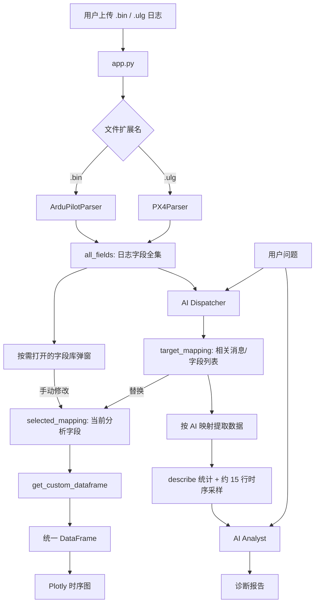
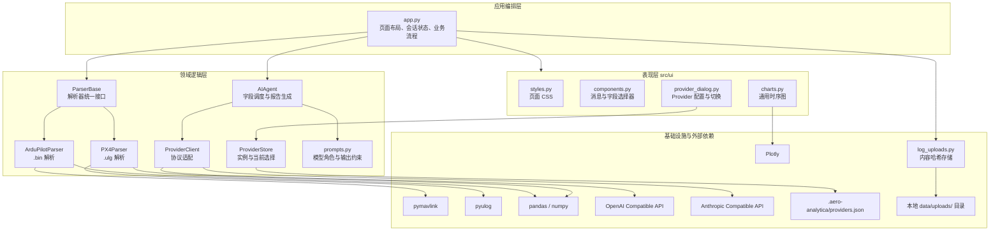
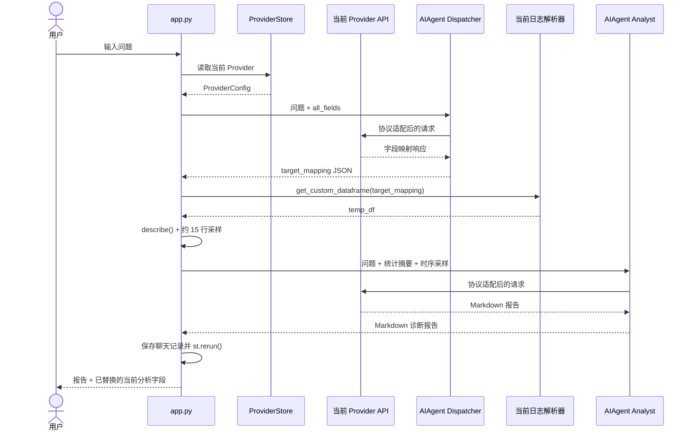

# Aero-Analytica 项目代码与架构说明

本文档说明当前项目到底是什么、代码如何组织、每个文件承担什么职责，以及一次“上传日志 -> AI 对话 -> 自动选择相关字段 -> 绘图 -> AI 报告”的完整执行过程。

文档以根目录 `app.py` 为项目入口，只描述当前代码和运行链路。

## 1. 项目定位

当前 Aero-Analytica 是一个 **AI 对话驱动的无人机日志动态分析工具**。

它不是把姿态、GPS、振动、PID 等指标写死在固定页面中，而是先读取当前日志实际包含的所有消息和字段，然后提供两种选择方式：

1. 用户在页面上手动展开消息并选择字段。
2. 用户用自然语言提问，由 AI 从字段全集中选择与问题最相关的消息和字段。

两种方式最终都会生成同一种字段映射，交给解析器按需提取数据，再用于 Plotly 绘图。AI 对话模式还会把提取结果压缩成统计摘要和时序采样，调用第二次模型生成诊断报告。

因此，当前 AI 并不是直接读取整个二进制日志。它承担两个角色：

- **字段调度员（Dispatcher）**：根据问题选择相关消息和字段列表。
- **数据分析员（Analyst）**：根据已提取数据的统计信息和采样点生成分析报告。

## 2. 核心运行链路



这个流程中最关键的中间对象是 `target_mapping`。例如用户询问“飞行过程中姿态是否稳定”，AI 预期返回类似：

```python
{
    "ATT": ["Roll", "Pitch", "Yaw"],
    "RATE": ["RDes", "R", "PDes", "P"]
}
```

这个 JSON 就是用户所说的“选出有关的列表”。它同时用于：

- 替换 `selected_mapping`，立即成为当前分析字段；
- 在当前字段区域标记最近一次 AI 推荐；
- 从日志中提取对应时序数据；
- 更新左侧通用图表；
- 为右侧 AI 报告准备数据。

`target_mapping` 和 `selected_mapping` 结构相同、职责不同：前者只记录最新 AI 推荐，后者是绘图的唯一选择源。AI 新推荐会整体替换当前选择；之后的手动添加、删除和清空只修改 `selected_mapping`。控件 key 包含选择修订号，因此新的 AI 推荐不会再被旧 Streamlit widget 状态覆盖。

## 3. 总体架构

项目可以分成四层。



各层职责如下：

| 层级 | 职责 | 不负责的内容 |
| --- | --- | --- |
| 表现层 | 控件、字段选择、图表和 CSS | 不直接解析日志或调用模型 |
| 应用编排层 | 串联上传、解析、选择、绘图和 AI 对话 | 不实现具体二进制格式 |
| 领域逻辑层 | 日志格式适配、数据对齐、AI 提示、Provider 配置模型和协议调用封装 | 不决定页面布局 |
| 基础设施层 | 文件、Provider 配置、DataFrame、图表引擎和外部 AI 服务 | 不决定页面业务流程 |

当前代码已按 UI、应用编排、领域逻辑和基础设施分层，但 `app.py` 仍直接编排全部流程，没有独立 service 层。

## 4. 项目目录和文件职责

```text
Aero-Analytica/
|-- app.py
|-- PROJECT_ARCHITECTURE.md
|-- README.md
|-- README_EN.md
|-- requirements.txt
|-- LICENSE
|-- tests/
|   |-- __init__.py
|   |-- test_agent.py
|   |-- test_charts.py
|   |-- test_field_selection.py
|   |-- test_log_uploads.py
|   |-- test_px4_parser.py
|   `-- test_providers.py
|-- assets/
|   `-- screenshots/
|       `-- README.md
|-- data/
|   |-- log100.bin
|   |-- log96.bin
|   |-- log_32_UnknownDate.ulg
|   `-- uploads/                    # Git 忽略
`-- src/
    |-- log_uploads.py
    |-- analyzer/
    |   |-- __init__.py
    |   |-- parser_base.py
    |   |-- ardu_parser.py
    |   `-- px4_parser.py
    |-- ai/
    |   |-- __init__.py
    |   |-- agent.py
    |   |-- providers.py
    |   `-- prompts.py
    `-- ui/
        |-- __init__.py
        |-- styles.py
        |-- components.py
        |-- charts.py
        `-- provider_dialog.py
```

### 根目录文件

| 文件 | 作用 |
| --- | --- |
| `app.py` | 当前 Streamlit 主入口，负责页面布局、会话状态和完整业务编排 |
| `README.md` / `README_EN.md` | 中英文项目概览、安装运行、当前能力和已知问题 |
| `PROJECT_ARCHITECTURE.md` | 当前代码、架构、调用关系和数据契约的详细说明 |
| `requirements.txt` | Python 依赖清单，大多数依赖未锁定版本 |
| `LICENSE` | GNU GPL v3 许可证 |
| `src/log_uploads.py` | 校验日志扩展名，计算 SHA-256，并将上传内容原子写入哈希路径 |
| `tests/` | 36 个无网络单元测试，覆盖上传存储、PX4 解析、Agent、Provider、字段选择和图表逻辑 |

### 资源和数据目录

| 路径 | 作用 |
| --- | --- |
| `assets/screenshots/` | 中英文 README 共用的界面截图槽位和拍摄说明 |
| `data/log100.bin` | ArduPilot 示例日志 |
| `data/log96.bin` | ArduPilot 示例日志 |
| `data/log_32_UnknownDate.ulg` | PX4 示例日志 |
| `data/uploads/<SHA-256>.<扩展名>` | 当前应用保存用户上传日志的 Git 忽略路径 |

三个包内的 `__init__.py` 当前均为空，只用于建立 Python 包结构。

## 5. `app.py`：应用入口和流程编排

`app.py` 是当前版本最重要的文件。它不负责具体解析算法，而是把 UI、解析器和 AI Agent 串联起来。

### 5.1 页面初始化

```python
st.set_page_config(
    layout="wide",
    page_title="Aero-Analytica | AI 诊断",
    page_icon="🛸"
)
apply_custom_styles()
```

页面使用宽屏布局，随后注入 `src/ui/styles.py` 中的 CSS。

### 5.2 Streamlit 会话状态

当前应用用六个 `st.session_state` 字段保存日志、字段选择与对话运行状态：

| 状态字段 | 类型 | 写入位置 | 使用位置 | 含义 |
| --- | --- | --- | --- | --- |
| `all_fields` | `dict` | 上传日志并扫描后 | 字段选择器、AI Dispatcher | 当前日志的消息和字段全集 |
| `target_mapping` | `dict` | AI Dispatcher 返回后 | 当前字段推荐标记 | AI 最新推荐的字段列表 |
| `selected_mapping` | `dict` | AI 推荐或手动操作后 | 数据提取、图表 | 当前真正用于绘图的字段列表 |
| `field_selection_revision` | `int` | 字段映射发生整体或手动变化后 | 字段控件 key | 隔离不同版本的 Streamlit 控件状态 |
| `chat_history` | `list[dict]` | 用户提问和报告生成后 | 右侧聊天框 | 仅用于当前会话的界面显示 |
| `parser` | `ParserBase` 子类 | 上传新文件后 | 手动绘图、AI 分析 | 当前日志对应的解析器实例 |

这里要特别区分：`chat_history` 会显示在 UI 中，但不会作为上下文发送给当前 Provider，因此当前不是多轮语义对话，只是界面上保留了多轮消息。Provider 列表及当前选择不在 Session State 中，而由 `ProviderStore` 持久化到本地 JSON。

### 5.3 侧边栏：Provider 和日志上传

侧边栏包含：

- 当前已配置 Provider 的单选列表；
- 打开“配置 API Provider”弹窗的按钮；
- 限制为 `.bin` 和 `.ulg` 的文件上传器。

配置弹窗包含“新增 Provider”和“管理 Provider”两个标签页。新增页从模板填充协议、Base URL、对话端点、模型列表端点和默认模型，允许获取模型、连接测试并保存启用；管理页支持获取模型、编辑、测试和确认删除。当前选择通过稳定 Provider ID 保存，因此显示名称或参数改变不会破坏引用。

上传后执行以下逻辑：

```text
uploaded_file
  -> 校验 .bin / .ulg 扩展名
  -> 计算内容 SHA-256
  -> 复用或原子写入 data/uploads/<SHA-256>.<扩展名>
  -> 按扩展名创建 ArduPilotParser 或 PX4Parser
  -> parser.list_all_fields()
  -> 写入 session_state.all_fields
```

解析器身份现在由内容哈希路径决定。相同内容重复上传不会重写或重新解析；同名但内容不同的日志会得到不同路径并重置字段状态。原子写入也避免了直接覆盖只读或已打开的示例日志。

### 5.4 左侧：当前字段、字段库弹窗和图表

左侧主页面只显示“当前分析字段”、添加/清空操作和图表，不再展开完整消息树。当前字段由 `render_selected_fields()` 渲染；消息内的多选框只包含已经选中的字段，因此删除标签即可移除字段。

“添加字段”按钮打开 `render_field_picker_dialog()` 大弹窗。弹窗先按消息名或字段名搜索，再用消息单选和该消息的字段多选完成编辑。任何时刻只为一个消息创建字段控件，不会因为日志包含 100 多种消息、1500 多个字段而产生同等数量的 widget。

`selected_mapping` 是最终需要绘图的映射。如果非空，主程序调用：

```python
df = st.session_state.parser.get_custom_dataframe(selected)
visible_columns = st.pills("显示曲线", get_plot_columns(df), ...)
render_main_chart(df, visible_columns)
```

“显示曲线”只过滤送入 Plotly 的列，不修改 `selected_mapping`。因此用户可以临时隐藏多数曲线或只看一条，之后仍能恢复显示而无需重新添加字段。字段选择修订号进入可见性控件 key；字段集合变化时，新控件默认显示全部曲线。

因此，解析器只有在用户真正选了字段后才遍历并抽取数值。

### 5.5 右侧：AI 对话

用户提交问题后，代码执行两个模型阶段：



具体步骤是：

1. 没有已激活 Provider 时只显示错误，不执行 AI 调用。
2. 将用户消息加入 `chat_history`。
3. 用已激活的 `ProviderConfig` 创建通用 `ProviderClient` 和 `AIAgent`。
4. `get_dispatch_plan()` 选择字段并写入 `target_mapping`，同时整体替换 `selected_mapping`。
5. 按本轮 AI 映射从当前日志提取 `temp_df`。
6. `get_analysis_report()` 基于数据生成报告。
7. 将报告加入 `chat_history`。
8. `st.rerun()` 重新渲染页面，当前字段与图表立即采用本轮 AI 映射。

所以当前 AI 对话的产品逻辑可以概括为：

```text
自然语言问题 -> 相关字段列表 -> 日志数据 -> 图表 + AI 报告
```

## 6. `src/analyzer`：日志解析层

### 6.1 `parser_base.py`

`ParserBase` 是抽象基类，规定所有日志解析器必须提供：

| 方法 | 输入 | 输出 | 设计目的 |
| --- | --- | --- | --- |
| `list_all_fields()` | 无 | `{消息名: [字段...]}` | 给手动 UI 和 AI 提供字段全集 |
| `get_custom_dataframe(field_mapping)` | 字段映射 | `DataFrame` | 只提取当前分析需要的数据 |

### 6.2 `ardu_parser.py`

`ArduPilotParser` 使用 `pymavlink` 读取 ArduPilot DataFlash `.bin` 日志。

#### `MODE_MAP`

将常见 Copter 模式数值映射为可读名称，如 `GUIDED`、`LAND`、`POSHOLD`。解析时统一转换为大写，未知值显示为 `MODE <数字>`。

#### `list_all_fields()`

作用是发现日志内的消息格式：

1. 创建 `mavlink_connection`。
2. 最多接收前 3000 条消息。
3. 从连接对象的 `formats` 或 `fmt` 字典读取格式定义。
4. 使用格式对象的 `name` 作为真实消息名。
5. 排除元数据消息。
6. 使用格式对象的 `columns` 作为字段列表。
7. 消息类型超过 40 后提前结束扫描。

返回值示例：

```python
{
    "GPS": ["TimeUS", "Status", "NSats", "Lat", "Lng", "Alt", "Spd"],
    "ATT": ["TimeUS", "DesRoll", "Roll", "DesPitch", "Pitch", "DesYaw", "Yaw"]
}
```

#### `get_custom_dataframe(field_mapping)`

作用是按映射动态提取数据：

1. 将映射中的消息名作为 `recv_match()` 目标。
2. 无论用户是否选择，额外加入 `MODE` 消息。
3. 优先读取 `TimeUS`，否则回退到 `GWkMS`，再除以 `1e6` 得到秒。
4. 普通字段重命名为 `<消息名>_<字段名>`。
5. 飞行模式写入统一的 `mode` 列。
6. 所有消息行按 `timestamp` 排序。
7. 使用 `ffill()` 将不同消息频率的数据对齐。

生成的数据最初是稀疏的。例如 ATT 和 GPS 在不同时间到达：

```text
timestamp  ATT_Roll  GPS_Alt
10.00      1.2       NaN
10.05      NaN       35.4
10.10      1.3       NaN
```

前向填充后变为：

```text
timestamp  ATT_Roll  GPS_Alt
10.00      1.2       NaN
10.05      1.2       35.4
10.10      1.3       35.4
```

这适合交互式趋势对比，但它代表“保留最近一次观测”，不是数学插值。

### 6.3 `px4_parser.py`

`PX4Parser` 使用 `pyulog` 读取 PX4 `.ulg`，并缓存同一解析器实例内的 ULog 对象。

执行流程：

1. `list_all_fields()` 遍历 `ULog.data_list`，从 `dataset.data` 读取实际字段并排除内部 `timestamp`。
2. topic 的 `multi_id=0` 使用原名，其他实例暴露为 `topic[1]`、`topic[2]` 等独立消息名。
3. `get_custom_dataframe()` 只提取映射中存在且长度与时间戳相同的一维字段。
4. PX4 微秒时间戳转为秒，同 topic 重复时间戳保留最后一条。
5. 所有选中 topic 的时间戳取并集，按时间排序后 `ffill()`，因此不会由字段映射的顺序决定输出采样率。
6. 如果存在 `vehicle_status.nav_state`，会自动生成 `mode` 列；未知枚举保留为 `NAV_STATE <数值>`，避免误标。

使用仓库 `data/log_32_UnknownDate.ulg` 实测可发现 77 个 topic、1684 个可选字段和 17 个非零多实例 topic。联合提取姿态、电池和本地位置可得到 389 行、8 列的单调时间轴，并识别到 `ALTCTL` 模式。

## 7. `src/ai`：Provider 适配、字段调度和报告生成

### 7.1 `providers.py`

Provider 子系统分成五个概念：

| 概念 | 作用 |
| --- | --- |
| `ProviderTemplate` | 某服务商的默认协议、Base URL、对话/模型端点、模型和 JSON Mode 能力 |
| `ProviderConfig` | 用户保存的独立 Provider 实例，拥有稳定 ID、名称、Key、模型列表端点和自定义 Headers |
| `ProviderStore` | 将 `providers: {id: config}` 与 `current` 原子保存到本地 JSON |
| `ProviderClient` | 把统一的对话和模型列表调用转换成目标协议请求 |
| `CompletionResult` | 保留响应文本和协议停止原因，并统一标识输出长度截断 |

内置模板包括 OpenAI、Anthropic、智谱 GLM、DeepSeek、OpenRouter、通义千问、硅基流动，以及两种自定义兼容模板。模板不是运行时全局单例；每次保存都会通过 `create_provider_from_template()` 生成新的 Provider ID，因此同一家服务可以配置多个账号、网关或模型。

本地状态结构为：

```json
{
  "version": 1,
  "current": "provider-id",
  "providers": {
    "provider-id": {
      "id": "provider-id",
      "name": "My Provider",
      "protocol": "openai_compatible",
      "base_url": "https://api.example.com/v1",
      "endpoint": "chat/completions",
      "models_endpoint": "models",
      "api_key": "...",
      "model": "example-model"
    }
  }
}
```

默认路径是 `.aero-analytica/providers.json`。保存过程先在同一目录写临时文件，再用 `os.replace()` 原子替换；该目录已加入 `.gitignore`。API Key 当前仍以明文保存在本机，`chmod(0o600)` 在 POSIX 系统可收紧权限，但 Windows 上不能替代系统凭据库。

协议适配规则：

- OpenAI Compatible：请求 `POST <base_url>/<endpoint>`，使用 `Authorization: Bearer`，从 `choices[0].message.content` 读取文本并保留 `finish_reason`；只有 Provider 声明支持时才发送 `response_format`。
- Anthropic Compatible：使用 `x-api-key` 和 `anthropic-version`，把 system 消息合并到独立 `system` 字段，从 `content` 文本块读取结果并保留 `stop_reason`。
- `list_models()` 请求 `<base_url>/<models_endpoint>`；模型端点也可以是完整 URL。它使用当前协议的鉴权 Headers，兼容 `data`/`models` 数组以及字符串或对象条目，并返回排序去重后的模型 ID。
- `complete()` 继续只返回字符串，供字段调度、连接测试和旧调用使用；`complete_with_metadata()` 返回 `CompletionResult`，供长报告判断是否需要续写。
- 两种协议都允许自定义 Headers 覆盖默认值，HTTP 错误只保留服务端错误摘要，避免把 Key 拼入应用错误消息。

模型发现允许表单暂时没有模型名称，但持久化和对话调用仍强制要求非空模型。已有 Provider JSON 缺少 `models_endpoint` 时，读取阶段会按协议补成 `models` 或 `v1/models`，因此无需单独迁移配置版本。

### 7.2 `agent.py`

`AIAgent` 不绑定某个 SDK、服务商或默认模型。字段调度使用通用 `complete()`；报告生成优先使用 `complete_with_metadata()` 检测截断，对仅实现 `complete()` 的自定义客户端仍保持兼容。模型名和网络协议完全来自当前 Provider 配置。

#### `get_dispatch_plan(user_query, fields_map)`

该方法实现“根据问题选相关列表”：

1. 把字段字典转换成逐行文本。
2. 将字段文本插入 `DISPATCHER_PROMPT`。
3. 把系统提示词和用户问题交给通用 Provider 客户端。
4. 请求 JSON 输出；若当前 Provider 不支持原生 JSON Mode，则仍依靠提示词约束并在本地解析。
5. 清理可能存在的 Markdown JSON 围栏。
6. 使用 `json.loads()` 转为 Python 字典。

它不读取具体日志数据，只看字段名称和用户问题。

解析后会验证结果非空、消息名存在、字段值是非空列表、字段名属于对应消息，并去除同一消息内的重复字段。消息名支持不区分大小写的精确归一化；字段名还允许唯一且高度相似的保守拼写纠正，例如将模型返回的 `MOTB.ThOut` 对齐到日志字段 `MOTB.ThrOut`。无法可靠纠正的条目会被过滤，只有整份映射都无效时才抛出错误。目前仍未限制消息和字段总数。

#### `get_analysis_report(user_query, df)`

该方法不把完整 DataFrame 发给模型，而是构造两类上下文：

- `numeric_df.describe()`：计数、均值、标准差、最小值、四分位数和最大值；
- 从表中按步长抽取约 15 行时序样本。

随后将统计摘要、采样数据和用户原问题发送给当前 Provider，首次最多请求 4000 个输出 token。空 DataFrame 会在调用模型前直接报错。

当 OpenAI Compatible 的 `finish_reason` 为 `length`/`max_tokens`/`max_output_tokens`，或 Anthropic Compatible 的 `stop_reason` 为相同截断原因时，Agent 会把已有报告作为 assistant 上下文，要求模型从断句处续写。每次续写最多 2500 个 token，最多续写两次；拼接时会去掉少量重复前缀。如果两次后仍被截断，报告末尾会显示不完整提示，而不再无限请求。正常停止的响应只调用 Provider 一次。

这个方法能降低发送的数据量，但约 15 个均匀采样点可能遗漏瞬时异常、短时振动或快速模式切换。

### 7.3 `prompts.py`

包含两个系统提示词：

| 提示词 | 模型角色 | 主要约束 |
| --- | --- | --- |
| `DISPATCHER_PROMPT` | 无人机系统工程专家 | 从现有字段中选择 3–5 个相关消息，返回标准 JSON |
| `ANALYST_PROMPT` | 无人机数据诊断专家 | 结合动力学和传感器原理，指出异常并给出建议，优先完整收尾 |

提示词和调用代码分开，便于独立调整 AI 行为，而不修改页面流程。

## 8. `src/ui`：界面组件层

### 8.1 `provider_dialog.py`

该模块负责 Provider 的全部交互界面：

- `render_provider_sidebar()` 读取 Store、渲染 Provider 单选列表并切换 `current`；
- `render_provider_dialog()` 使用 Streamlit Dialog 提供新增和管理标签页；
- 新增页根据模板动态填充表单，支持获取模型、高级 Headers 与 JSON Mode 开关；
- 管理页保留 Provider ID 和创建时间，可编辑协议与所有连接参数；
- 获取模型和测试连接都不会保存配置；获取成功后保留弹窗并显示模型选择框，保存成功后自动启用，删除需要显式确认。

该模块只处理表单和 Store 调用，真实协议请求仍由 `ProviderClient` 完成。

### 8.2 `styles.py`

`apply_custom_styles()` 通过 `st.markdown(..., unsafe_allow_html=True)` 注入 CSS，负责：

- 浅灰页面背景；
- Expander 的白色背景、边框、阴影和圆角；
- 按钮的橙色渐变；
- 多选标签的深色样式。

该文件只改变表现，不处理业务状态。

### 8.3 `components.py`

`components.py` 将纯映射逻辑和 Streamlit UI 分开：

1. `sanitize_field_mapping()` 去重并过滤当前日志中不存在的消息和字段。
2. `set_message_fields()` 只替换一个消息的选择，保留其他消息。
3. `filter_field_messages()` 对消息名和字段名做不区分大小写的搜索。
4. `render_selected_fields()` 只渲染当前分析字段，并标记与最新 AI 推荐相交的消息。
5. `render_field_picker_dialog()` 在独立大弹窗中按消息编辑完整字段库。

每次 AI 替换、手动应用、清空或切换日志都会增加 `field_selection_revision`。该值进入字段控件 key，让新映射生成新控件状态，避免旧 Multiselect 状态覆盖新的默认值。

### 8.4 `charts.py`

`render_main_chart(df, visible_columns)` 负责通用 Plotly 图表：

- 空表时显示提示信息；
- 跳过 `timestamp` 和 `mode`；
- 其余每列生成一条折线；
- 状态和计数类字段放在右 Y 轴；
- `mode` 变化区间绘制为灰色背景；
- 开启统一悬停、横向图例和 X 轴范围滑块。
- 仅绘制可见性标签选中的列，并支持图例单击隐藏、双击隔离一条曲线。

图表并不知道 ATT、GPS、IMU 等具体含义，完全根据 DataFrame 列动态绘制。这也是当前架构可以支持任意字段组合的原因。

## 9. 核心数据契约

不同模块通过四种数据结构解耦。

### 9.1 字段全集 `all_fields`

```python
dict[str, list[str]]
```

由解析器生成，供 UI 和 Dispatcher 使用。

### 9.2 字段映射 `target_mapping` / `selected_mapping`

```python
dict[str, list[str]]
```

两者结构相同，但来源不同：

- `target_mapping` 是 AI 建议；
- `selected_mapping` 是当前页面真正用于绘图的选择；
- AI 返回时 `selected_mapping = target_mapping`，手动编辑后两者可以不同。

### 9.3 统一 DataFrame

```text
timestamp | <message>_<field> | ... | mode
```

- `timestamp` 必须存在，否则图表无法绘制；
- 数据列使用消息名前缀避免不同消息的同名字段冲突；
- `mode` 是可选列，目前只有 ArduPilot 自动提供。

### 9.4 聊天历史

```python
[
    {"role": "user", "content": "..."},
    {"role": "assistant", "content": "..."}
]
```

仅用于 Streamlit 当前会话展示，不参与后续模型调用。

### 9.5 Provider 状态

```python
ProviderState(
    providers={provider_id: ProviderConfig(...)},
    current=provider_id,
)
```

模板只负责创建默认值，`ProviderConfig` 才是实际调用使用的实例。Provider ID 是存储和切换依据，名称只用于显示且在同一 Store 中不允许重名。

## 10. 依赖在架构中的作用

| 依赖 | 使用位置 | 作用 |
| --- | --- | --- |
| `streamlit` | `app.py`、`src/ui/*` | 页面、会话状态、上传、控件和聊天界面 |
| `plotly` | `src/ui/charts.py` | 交互式时序图 |
| `pymavlink` | `src/analyzer/ardu_parser.py` | 读取 ArduPilot DataFlash `.bin` |
| `pyulog` | `src/analyzer/px4_parser.py` | 读取 PX4 `.ulg` |
| `pandas` | 两个解析器、AI Agent | 表格组织、时间对齐、统计摘要 |
| `numpy` | ArduPilot 解析器、AI Agent | 缺失值和数值列类型选择 |
| `httpx` | `src/ai/providers.py` | 调用 OpenAI/Anthropic Compatible HTTP API，并支持 mock 测试 |
| `watchdog` | 间接依赖/开发体验 | Streamlit 文件变化监听 |

`requirements.txt` 只约束了 `httpx` 的最低版本，其余依赖没有版本约束，因此不同安装时间仍可能得到行为不同的解析库版本。

## 11. 测试代码

这里是当前可重复、无网络的 36 个单元测试。`test_log_uploads.py` 覆盖哈希存储、只读文件复用、同名不同内容和扩展名校验；`test_px4_parser.py` 覆盖字段发现、多实例 topic、时间对齐、模式列和仓库真实 `.ulg` 回归；`test_providers.py` 覆盖 Provider 存储、OpenAI/Anthropic 请求、模型列表、停止原因和错误脱敏；`test_agent.py` 覆盖字段映射校验、保守拼写纠正、报告自动续写和空表保护；`test_field_selection.py` 和 `test_charts.py` 覆盖字段选择与曲线可见性纯逻辑。

当前仍缺少：

- ArduPilot 字段扫描和数据对齐回归测试；
- 图表和 Streamlit 主流程测试；
- 空日志、损坏日志和网络异常测试。

## 12. 架构优点

1. **动态 Schema**：页面不依赖固定消息名，可展示日志内实际存在的字段。
2. **按需读取**：用户或 AI 选中字段后才提取数值，避免无条件构造完整大表。
3. **统一选择协议**：手动选择和 AI 选择都使用 `{消息: [字段]}`，两条路径可以汇合。
4. **解析器接口统一**：ArduPilot 和 PX4 都面向同一抽象接口。
5. **表现层已拆分**：样式、字段组件和图表不再全部堆积在入口文件中。
6. **AI 分工清晰**：字段选择和数据解释使用两个不同阶段，职责比单次大提示更明确。
7. **Provider 与 Agent 解耦**：模板、实例、当前选择和协议请求各自独立，新增兼容服务通常只需增加模板。
8. **基础错误边界和测试已建立**：无 Provider、无日志、空表、非法字段映射和网络请求失败均有明确错误路径。

## 13. 主要架构问题

1. **Provider Key 明文保存**：配置文件虽被 Git 忽略，但还没有接入 Windows Credential Manager 等系统密钥库。
2. **兼容协议不是完全统一标准**：个别供应商的鉴权、端点或请求字段仍可能需要专用适配。
3. **解析异常没有统一边界**：文件和底层解析异常可能直接中断 Streamlit 当前运行。
4. **时间对齐策略比较粗**：ArduPilot 和 PX4 都使用事件时间轴并向前填充，低频值会持续到下一次更新。
5. **AI 上下文不是完整时序**：均匀采样可能漏掉短时异常。
6. **没有真正的多轮对话上下文**：聊天历史只显示，不发送给模型。
7. **上传文件没有生命周期管理**：文件长期保留在 `data/uploads/`，没有大小和清理策略。
8. **入口仍承担过多编排**：解析器生命周期、AI 流程和错误处理都直接位于 `app.py`。

## 14. 推荐的后续演进结构

在保持当前产品形态的前提下，可以逐步演进为：

```text
app.py
  -> services/log_service.py       上传、文件身份、解析器生命周期
  -> services/analysis_service.py  字段映射校验、提取、摘要生成
  -> analyzer/*                    只负责格式读取和标准化
  -> ai/*                          只负责模型调用和响应解析
  -> ui/*                          只负责页面组件和展示
  -> schemas/*                     FieldMapping、分析结果等结构定义
```

优先顺序建议：

1. 将 Provider Key 迁移到系统密钥库。
2. 为 Provider 配置 UI 和两个协议增加 Streamlit 端到端测试，并覆盖供应商差异。
3. 增加损坏文件和底层解析失败的统一 UI 错误处理。
4. 为哈希上传目录增加容量上限和自动清理。
5. 把数据抽取和摘要逻辑移入独立 service，减轻 `app.py`。
6. 根据分析类型增加异常保留采样，而不是只做均匀 15 点采样。

## 15. 最终理解

当前项目的核心是下面这条主线：

```text
日志字段发现
  -> 用户自然语言提问
  -> AI 选择相关消息/字段列表
  -> 解析器按需抽取并统一时间轴
  -> 页面展开命中消息，并通过字段选择器确认绘图字段
  -> 当前 Provider 根据统计摘要和采样数据生成报告
```

手动字段选择是这条主线的另一个入口；它绕过 AI Dispatcher，但复用同一个解析器和图表数据契约。`app.py` 负责整个流程，`src/analyzer` 负责日志读取，`src/ai` 负责 Provider 协议适配与两阶段模型调用，`src/ui` 负责 Provider 管理、字段列表和可视化。

这就是当前版本真实的产品形态和代码架构。
