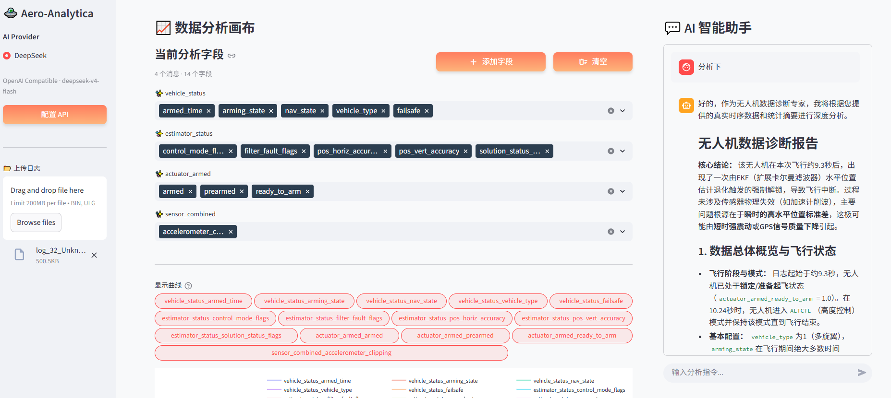
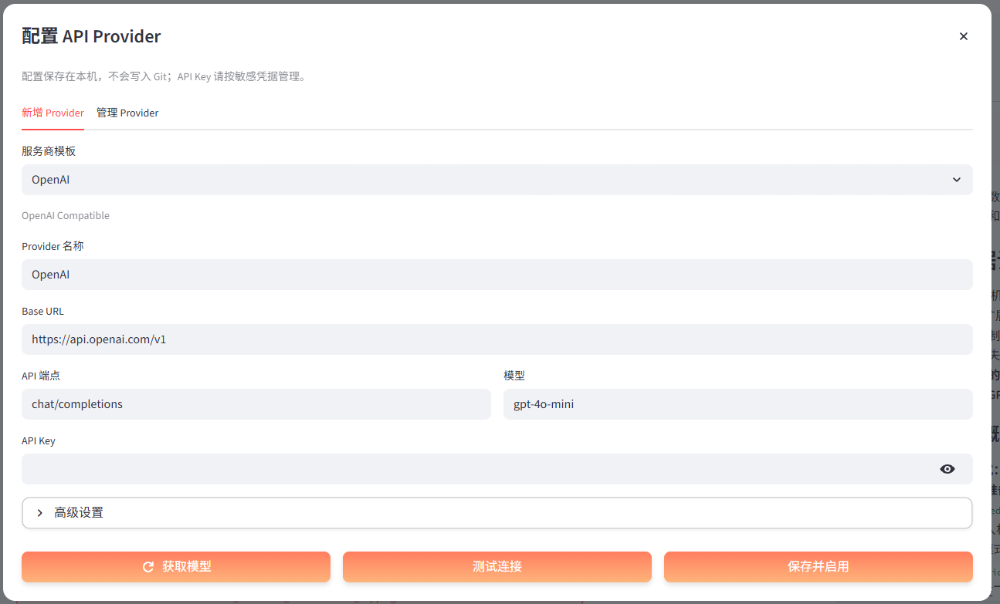
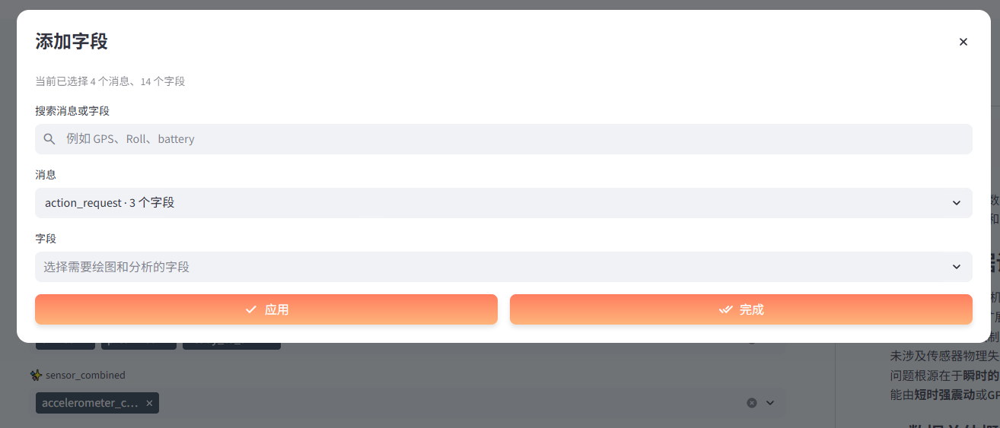
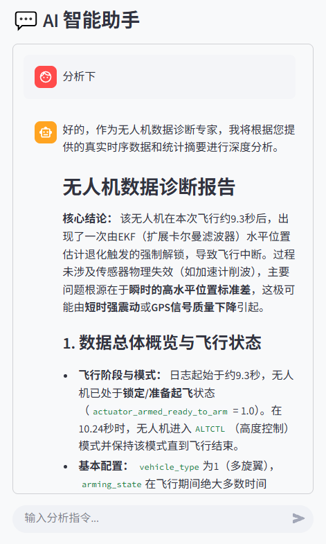

# Aero-Analytica

[中文](README.md) | **English**

Aero-Analytica is an interactive UAV flight-log explorer and AI-assisted diagnostic tool. It supports ArduPilot `.bin` and PX4 `.ulg` logs, dynamically discovers messages, topics, and fields, aligns manually selected or AI-recommended data into time-series charts, and generates diagnostic reports from statistical summaries.

The application is built with Streamlit for flight debugging, troubleshooting, and log-data exploration.

## RepoPilot

This repository also contains **RepoPilot**, a TypeScript harness for running, verifying, recovering and evaluating Pi Agent on repository tasks. Pi owns the agent loop; RepoPilot provides context selection, Git worktree isolation, constrained tools, verification gates, checkpoints, trace replay and evaluation reports.

The Streamlit application now includes an **Engineering Evaluation** workspace. It runs bundled PX4, ArduPilot and ROS fixture tasks, or a user-selected local Git repository plus task YAML, through Fake or Pi Agent in an isolated worktree. It exposes verification, diffs, context, traces and HTML reports, and complements rather than replaces flight-log analysis. See [README_REPOPILOT.md](README_REPOPILOT.md) for the CLI, Pi configuration and task YAML.

## Features

- **ArduPilot and PX4 support**: Parse `.bin` and `.ulg` logs, including multi-instance PX4 topics.
- **Dynamic field discovery**: Show only the messages and fields that exist in the current log.
- **AI field recommendation**: Select relevant data from the log schema based on a natural-language question.
- **Manual field control**: Search, add, remove, show, or hide individual chart series.
- **Interactive time-series charts**: Use dual Y axes, a range slider, and flight-mode backgrounds.
- **Multiple Provider management**: Save, edit, test, delete, and switch between AI Providers.
- **Common API protocols**: Connect to OpenAI Compatible and Anthropic Compatible endpoints.
- **Remote model discovery**: Fetch models from a Provider or enter a model name manually.
- **Automatic report continuation**: Continue an incomplete report when a model reaches its output limit.
- **Content-addressed uploads**: Store logs by SHA-256 hash so same-named files cannot overwrite one another.
- **Engineering evaluation workspace**: Run reproducible suites or a local Git repository task, then inspect verification, Trace, final diff, retained worktree, and an evaluation report.

## Screenshots

### Main Workspace



### Provider Configuration



### Field Selection



### AI Diagnostics



## Workflow

```text
Upload a .bin / .ulg log
           |
           v
Discover messages, topics, and fields
           |
           +--------------------+
           |                    |
    Manual selection       AI recommendation
           |                    |
           +----------+---------+
                      |
                      v
          Extract and align time-series data
                      |
           +----------+----------+
           |                     |
      Plotly charts      Statistics and samples
                                 |
                                 v
                         AI diagnostic report
```

AI analysis has two stages:

1. The **Dispatcher** selects relevant fields from the current log schema and user question.
2. The **Analyst** generates a report from statistics and sampled time-series rows.

Raw log files are not sent directly to the AI Provider. The request includes the user question, field schema, statistical summary, and a small time-series sample.

## Quick Start

### Requirements

- Python 3.9 or later
- Access to an AI API is optional; manual log analysis works without one
- Node.js 20.6 or later is required only for Engineering Evaluation

### Install and Run

```powershell
git clone <your-repository-url>
cd Aero-Analytica

python -m venv .venv
.\.venv\Scripts\Activate.ps1
python -m pip install -r requirements.txt
# Required only for Engineering Evaluation
npm install
python -m streamlit run app.py
```

Open <http://localhost:8501> after startup.

## Usage

1. Upload an ArduPilot `.bin` or PX4 `.ulg` log from the sidebar.
2. For manual analysis, open the field selector and search for the data to plot.
3. For AI analysis, select **Configure API**, choose a Provider template, and enter the API key, endpoint, and model.
4. Save the Provider, then ask a flight-related question such as "Is the aircraft underpowered?" or "Was altitude control stable?"
5. AI-recommended fields appear on the left, where fields can still be added, removed, or hidden individually.
6. After chart data is prepared, the diagnostic report appears on the right.
7. Open **Engineering Evaluation** → **Bundled Evaluation** to run the deterministic suites. Fake mode is offline.
8. Use **Local Repository** with a local Git path and a trusted task YAML. Pi Agent uses the Provider selected in the sidebar, and its successful worktree can be retained for inspection.

## Provider Configuration

Built-in templates include OpenAI, Anthropic, DeepSeek, Zhipu GLM, OpenRouter, Qwen, SiliconFlow, and a custom Provider.

Each Provider can configure:

- Protocol type
- Base URL and API endpoint
- API key
- Model and model-list endpoint
- Custom headers
- JSON Mode

Provider state is stored locally in `.aero-analytica/providers.json`. The directory is excluded by `.gitignore`, but API keys are currently stored as plaintext on the local machine. Use the application only on a trusted device.

## Project Structure

```text
Aero-Analytica/
|-- app.py                         # Streamlit entry point
|-- README.md                      # Chinese guide
|-- README_EN.md                   # English guide
|-- PROJECT_ARCHITECTURE.md        # Detailed architecture and data flow
|-- requirements.txt               # Python dependencies
|-- package.json                   # RepoPilot Node dependencies and commands
|-- assets/screenshots/            # UI screenshots
|-- src/
|   |-- analyzer/                  # ArduPilot and PX4 parsers
|   |-- ai/                        # Providers, Agent, and prompts
|   |-- repopilot/                 # Bounded Streamlit-to-RepoPilot CLI bridge
|   |-- ui/                        # UI, charts, and controls
|   `-- log_uploads.py             # Upload validation and hash storage
|-- repopilot/                     # Pi Agent execution harness
|-- evals/                         # PX4 / ArduPilot / ROS tasks and suites
`-- tests/                         # Offline unit tests
```

Runtime logs are stored in the local `data/` directory. This directory, flight logs, and Provider configuration are not tracked by Git.

See [PROJECT_ARCHITECTURE.md](PROJECT_ARCHITECTURE.md) for module responsibilities, data contracts, and request flows.

## Testing

The test suite does not call a real AI service:

```powershell
python -m unittest discover -s tests -v
python -m compileall -q app.py src tests
npm run typecheck
npm test
npm run eval:smoke
```

Python tests cover upload storage, PX4 parsing, Provider protocols, the AI Agent, field selection, charts, and the RepoPilot bridge. TypeScript tests cover RepoPilot execution, recovery, context, and isolation.

## Current Limitations

- Chat history is currently display-only and is not sent as complete multi-turn context.
- AI analysis uses statistics and sampled rows, so short transient events may be missed.
- The upload directory has no size limit or automatic cleanup policy.
- API keys are not yet stored in an operating-system credential manager.
- Data export, report export, and full Streamlit end-to-end tests are not implemented.

## License

This project is licensed under the [GNU General Public License v3.0](LICENSE).
